<div align="center">
  

  <h1>Riks AI</h1>
  <p><strong>Không gian agent tối giản để chat, phân tích mã nguồn, gọi công cụ và chạy LLM cục bộ.</strong></p>

  <p>
    <a href="#tinh-nang"></a>
    <a href="#cong-nghe"></a>
    <a href="#frontend"></a>
    <a href="#llm"></a>
  </p>
</div>

---

## Tổng quan

**Riks AI** là prototype assistant dành cho lập trình: giao diện chat hiện đại, backend FastAPI, agent layer có thể mở rộng, memory đơn giản và các adapter công cụ cho file, terminal, GitHub, Ollama.

Thiết kế hướng tới ba tiêu chí:

- **Tối giản:** cấu trúc dễ đọc, dễ chạy local, ít phụ thuộc thừa.
- **Hiện đại:** frontend Next.js, backend FastAPI, cấu hình qua biến môi trường.
- **Mở rộng:** tách lớp agent, model, memory, tool để phát triển dần thành IDE assistant.

## Tính năng

| Trạng thái | Tính năng | Mô tả |
| --- | --- | --- |
| ✅ | Chat API | Endpoint `/api/chat` nhận message, lưu hội thoại và gọi Ollama. |
| ✅ | Agent planning | `RiskAgent` và `RiskPlanner` tạo kế hoạch/tách task từ prompt. |
| ✅ | Code assistant | `RiskCoder` phân tích, sinh và đề xuất sửa code qua LLM. |
| ✅ | Tool adapters | File tools, terminal execution, GitHub REST wrapper cơ bản. |
| 🧭 | Tool routing | Định tuyến tool tự động từ chat vẫn là roadmap. |
| 🧭 | RAG & long-term memory | Vector database và memory bền vững sẽ được bổ sung sau. |

## Kiến trúc

```text
Riks AI
├─ Frontend: Next.js + React chat UI
├─ Backend: FastAPI API server
├─ Agents: RiskAgent, RiskCoder, RiskPlanner
├─ LLM: Ollama-compatible local model client
├─ Memory: in-process conversation store
└─ Tools: file, terminal, GitHub adapters
```

## Công nghệ

### Backend

- Python 3.11
- FastAPI
- Pydantic / pydantic-settings
- HTTPX
- Uvicorn

### Frontend

- Next.js 14
- React 18
- TypeScript
- Axios

### LLM

- Ollama-compatible API
- Có thể mở rộng sang Qwen, DeepSeek, Llama hoặc provider khác.

## Cấu trúc dự án

```text
riks/
├─ backend/
│  ├─ agents/
│  ├─ api/
│  ├─ config/
│  ├─ main.py
│  ├─ memory.py
│  ├─ models.py
│  ├─ requirements.txt
│  └─ tools.py
├─ frontend/
│  ├─ app/
│  ├─ components/
│  ├─ next.config.js
│  └─ package.json
├─ docker/
├─ docs/
│  └─ assets/riks-ai-logo.svg
└─ environment.yml
```

## Chạy local

### Backend

```bash
python -m venv .venv
source .venv/bin/activate
pip install -r backend/requirements.txt
PYTHONPATH=backend python backend/main.py
```

### Frontend

```bash
npm --prefix frontend install
npm --prefix frontend run dev
```

Ứng dụng frontend mặc định gọi backend tại `http://localhost:8000`. Có thể đổi bằng biến môi trường `NEXT_PUBLIC_API_URL`.

## Cấu hình

| Biến môi trường | Mặc định | Mô tả |
| --- | --- | --- |
| `API_HOST` | `0.0.0.0` | Host backend FastAPI. |
| `API_PORT` | `8000` | Port backend FastAPI. |
| `API_RELOAD` | `false` | Bật reload khi phát triển local. |
| `ALLOWED_ORIGINS` | `http://localhost:3000` | Origin được CORS cho phép. |
| `OLLAMA_URL` | `http://localhost:11434` | URL Ollama API. |
| `OLLAMA_MODEL` | `llama3.1` | Model mặc định khi generate. |

## Kiểm thử và build

```bash
python -m compileall backend
npm --prefix frontend run build
```

## Roadmap

- [ ] Tool router tự động cho `/api/chat`.
- [ ] Sandbox terminal an toàn hơn cho command execution.
- [ ] Test suite với pytest và API smoke tests.
- [ ] Persistent memory bằng SQLite/PostgreSQL.
- [ ] RAG với ChromaDB, Qdrant hoặc FAISS.
- [ ] GitHub issue/PR workflow có authentication.

## Logo và nhận diện

Logo **Riks AI** dùng biểu tượng orbital intelligence: chữ **R** nằm trong quỹ đạo chuyển động, nền gradient tối và các điểm sáng xanh/cyan gợi cảm giác agent đang xử lý tín hiệu. SVG có animation nhẹ nên README vẫn tối giản nhưng nổi bật.

## License

Xem [LICENSE](LICENSE).
